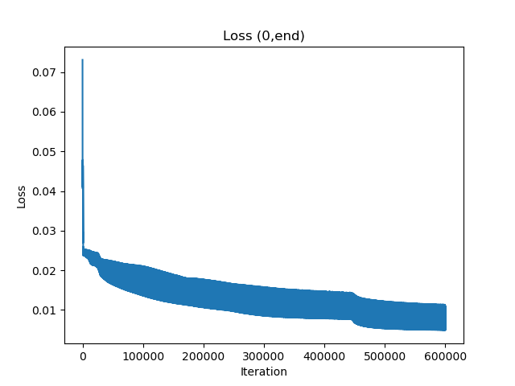
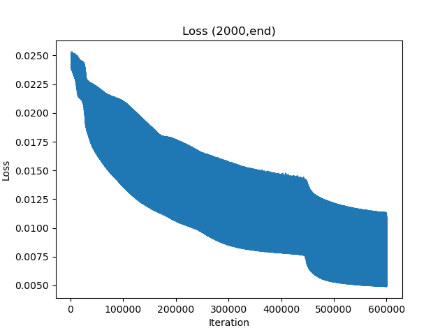

# Neural Network
An OpenCL implementation of backpropagation algorithm. 

- Works with Nvidea and AMD GPU
- Dense and Convolutional Layers

## Installation

```sh
git clone https://github.com/arestrepo99/NeuralNetwork
```

## Requirements

```sh
pip install numpy,pyopencl
```

## Example

```python
import numpy as np
from NeuralNetwork import NeuralNetwork
from Layers import Dense, Reshape, Conv, sigmoid
from utils.Tensor import Tensor
import matplotlib.pyplot as plt
import pickle
from IPython.display import clear_output
mnist = pickle.load(open('mnist.pkl','rb'))

batchSize = 100
x_train = Tensor((mnist['training_images'].reshape(-1,batchSize,28,28)/255))
y_train = Tensor(np.array([[0]*i+[1]+[0]*(9-i) for i in mnist['training_labels']]).reshape((-1,batchSize,10)))
x_test = Tensor((mnist['test_images'].reshape(-1,batchSize,28,28)/255))
y_test = mnist['test_labels'].reshape((-1,batchSize))

model = NeuralNetwork([Conv((5,5),sigmoid,filters=6,padding=2,strides=(2,2),inputShape=(28,28,1)),
                        Conv((5,5),sigmoid,filters=10),
                        Conv((5,5),sigmoid,filters=16),
                        Reshape(-1), 
                        Dense(100,sigmoid),
                        Dense(10,sigmoid)])

def plotfunc(model):
    if len(loss) % 500 == 0 :
        plt.plot(loss)
        plt.xlabel("Iteration")
        plt.ylabel("Loss")
        plt.title("Loss (0,end)")
        plt.figure()
        plt.title("Loss (2000,end)")
        plt.xlabel("Iteration")
        plt.ylabel("Loss")
        plt.plot(range(2000,len(loss)),loss[2000:])
        plt.pause(0.1)
        clear_output(wait=True)
 
print(model)
model.train(x_train, y_train, epochs=1000, lrate=0.01, plotfunc=plotfunc)
```

 MODEL SUMMARY: \
Input: 		 (28, 28, 1)\
Conv Layer: 		(14, 14, 6)\
Conv Layer: 		(10, 10, 10)\
Conv Layer: 		(6, 6, 16)\
Reshape Layer: 		(576,)\
Dense Layer: 		(100,)\
Dense Layer: 		(10,)


)
)
